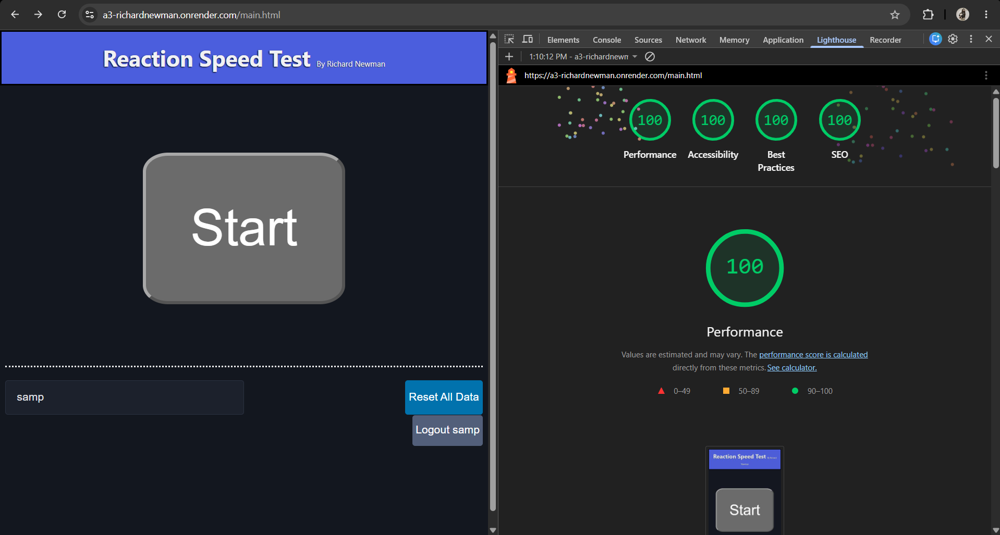

# Richard Newman - Assignment 3 - Persistence: Two-tier Web Application with Database, Express server, and CSS template

Richard Newman
 
https://a3-richardnewman.onrender.com/main.html

## Updated Reaction Speed Test

For this assignment, I updated the reaction speed test I made for assignment 2, migrating it to use express and mongodb for persistence in the backend, updating the visuals using the CSS framework PicoCSS, and adding login functionality. Now, instead of showing all the data on the server, the data shown on the main page is per-user, with all of the options to add, delete, and modify the reaction times remaining functional. This application can now measure users' reaction times as before, but will save their data and allow them to log back in at any time. PicoCSS was able to add quite a bit of style to the program just by importing it, but customization was needed for minor adjustments such as forcing dark mode to keep the design consistent, adding classes to make certain buttons "secondary" to change their style, and adjusting the size, margin, and padding of items to make everything feel properly proportioned on the page. I chose PicoCSS because, as one of the frameworks advertised as "classless", it had a lot of styling for html elements and had an appealing design right out of the bat. My authentication strategy of choice was a simple username and password check in the database; I wanted to try OAuth, but didn't end up allocating enough time into the project to allow for that and scrapped it after spending some time on it due to time constraints. My largest challenges were getting MongoDB to cooperate, since having to handle requests and responses that are passed between the client and server leaves much room for error, as well as making them harder to track down. Aggregation functions specifically were interesting but time-consuming to learn for MongoDB, and after returning the application to its previous functionality I had to refactor it once again to make it so the data could be retrieved and modified in a user-specific way.

## Technical Achievements

- **Lighthouse Tests Passed**: Using Google Chrome's built-in lighthouse tests in an incognito tab with my site gave it a 100% with all 4 categories (with fireworks) for both the login and main pages. The pages would inconsistently give lower performance metrics when not incognito; exploring the treemap shows a majority of the data being from scripts executed by browser extensions. Additionally, the score was brought down by the fact that the layout slightly shifted when the data was brought in from the server; when the user's time list is empty, the score reaches 100%. For this result, I had to optimize some of my requests to the database, since many could be combined from two separate requests into one by also sending the relevant user's data along with the response. The test was also seemingly picky on giving a 100% score due to the amount of unused CSS from the chosen CSS framework. It aditionally gave some warnings about blocking requests; I deferred the CSS framework and edited the main CSS to prevent any particularly major page changes as a result, and minified my JS and CSS. The login page was much more consistent in getting full marks, since the page itself was much smaller and simpler.

- **Express Middleware**: I used the following express middleware:
    - cookie-session: The recommended middleware to handle cookies that was used both to keep a user logged in and to maintain track of a specific user's username through the session cookie in the requests.

## LLM Use

During this project, I consulted Claude to help debug my login page not functioning properly (quite late into the night). No code was pasted into the LLM. After asking question such as why a response's body may be undefined, I was able to resolve problemss including forgetting to include the header for the body type in one place but not another, as well as needing to manually update the URL to the main page on successful login since I prevented the default form submit due to earlier troubles with it and thus needed to change the page manually.
